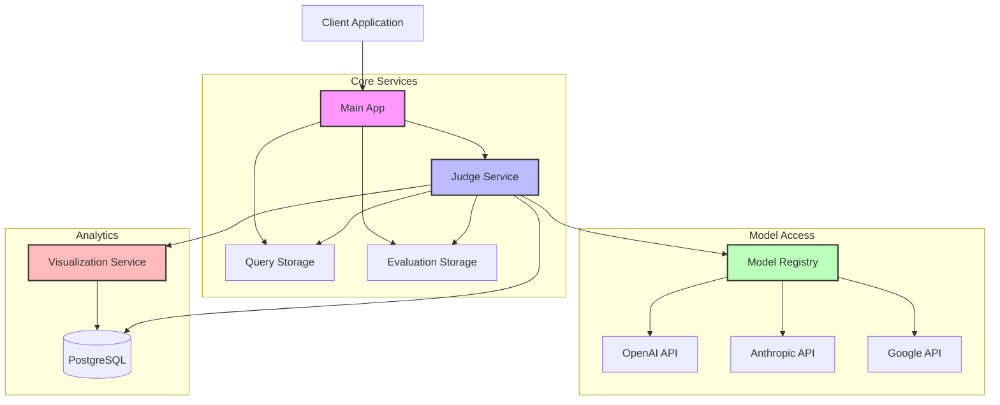

# Panopticon

[](http://localhost:8000/docs)
[](https://opensource.org/licenses/MIT)

## Overview

Panopticon is a comprehensive framework for evaluating and comparing Large Language Models (LLMs) across diverse tasks and metrics. With its microservices architecture, Panopticon enables systematic testing of multiple models from different providers through a unified interface.

**Key Features:**

- **Multi-provider Support**: Evaluate models from OpenAI, Anthropic, Google, and more
- **Metric-based Evaluation**: Define custom evaluation criteria to assess model outputs
- **Thematic Testing**: Organize test queries by themes to evaluate specific capabilities
- **Interactive Dashboard**: Visualize and compare model performance across metrics
- **Extensible Architecture**: Easily add new models, providers, and evaluation criteria

## User Journey

### 1. Setup and Installation

```bash
# Clone the repository
git clone https://github.com/yourusername/panopticon.git
cd panopticon

# Create .env file with your API keys (copy from .env.example)
cp .env.example .env

# Edit the .env file to add your API keys
nano .env

# Start all services with Docker Compose
docker-compose up -d
```

This will start the following services:
- Main App: http://localhost:8000
- Visualization Dashboard: http://localhost:8004

### 2. Creating Test Queries

Test queries are the prompts you'll use to evaluate different language models. They should be organized by themes to focus on specific capabilities.

#### From the Command Line:

```bash
# Add a science explanation query
curl -X POST http://localhost:8001/api/v1/items \
  -H "Content-Type: application/json" \
  -H "X-API-Key: dev_api_key_for_testing" \
  -d '{
    "item": "Explain quantum computing to a high school student.",
    "type": "science_explanation", 
    "metadata": {
      "difficulty": "medium",
      "domain": "physics"
    }
  }'

# Add a reasoning query
curl -X POST http://localhost:8001/api/v1/items \
  -H "Content-Type: application/json" \
  -H "X-API-Key: dev_api_key_for_testing" \
  -d '{
    "item": "A bat and ball cost $1.10 in total. The bat costs $1.00 more than the ball. How much does the ball cost?",
    "type": "reasoning",
    "metadata": {
      "difficulty": "medium",
      "domain": "mathematics"
    }
  }'
```

#### Bulk Import:

For larger query sets, prepare a JSON file with your queries:

```json
[
  {
    "item": "Explain how nuclear fusion works.",
    "type": "science_explanation",
    "metadata": {"difficulty": "hard", "domain": "physics"}
  },
  {
    "item": "Write a short story about a robot discovering emotions.",
    "type": "creative_writing",
    "metadata": {"style": "narrative", "length": "medium"}
  }
]
```

Then import them:

```bash
curl -X POST http://localhost:8001/api/v1/items/bulk \
  -H "Content-Type: application/json" \
  -H "X-API-Key: dev_api_key_for_testing" \
  -d @queries.json
```

### 3. Defining Evaluation Metrics

Evaluation metrics are the criteria used to assess model responses. Good metrics should be specific and measurable.

#### From the Command Line:

```bash
# Create a scientific accuracy metric
curl -X POST http://localhost:8002/api/v1/items \
  -H "Content-Type: application/json" \
  -H "X-API-Key: dev_api_key_for_testing" \
  -d '{
    "item": "Evaluate the scientific accuracy of this explanation on a scale of 1-10. Consider: Are all stated facts correct? Are any important concepts missing or misrepresented? Provide your rating with a brief justification.",
    "type": "scientific_accuracy",
    "metadata": {
      "description": "Measures factual correctness of scientific explanations",
      "scale": "1-10"
    }
  }'

# Create a clarity metric
curl -X POST http://localhost:8002/api/v1/items \
  -H "Content-Type: application/json" \
  -H "X-API-Key: dev_api_key_for_testing" \
  -d '{
    "item": "Rate the clarity of this explanation on a scale of 1-10. Consider: Is it easy to understand? Does it use appropriate language for the target audience? Are complex concepts broken down effectively? Provide your rating with a brief justification.",
    "type": "clarity",
    "metadata": {
      "description": "Measures how clearly the information is communicated",
      "scale": "1-10"
    }
  }'
```

#### Using the Dashboard:

1. Navigate to http://localhost:8004
2. Go to the "Data Management" section
3. Click on "Add Metric"
4. Fill in the evaluation prompt, metric type, and metadata
5. Click "Save"

#### Recommended Metric Types:

- **accuracy**: Factual correctness
- **clarity**: Clear communication
- **completeness**: Comprehensive coverage
- **creativity**: Original thinking
- **reasoning**: Logical thinking
- **helpfulness**: Practical utility
- **safety**: Avoiding harmful content

### 4. Running Evaluations

Once you have queries and metrics, you can evaluate models against them.

Register you model first

```bash
curl -X POST http://localhost:8005/api/v1/models \
  -H "Content-Type: application/json" \
  -H "X-API-Key: dev_api_key_for_testing" \
  -d '{
    "id": "gpt-4o-2024-11-20",
    "name": "gpt-4o-2024-11-20",
    "provider_id": "openai",
    "is_available": true,
    "config": {
      "max_tokens": 4096
    }
  }'

```

#### Evaluating a Single Query:

```bash
curl -X POST http://localhost:8003/api/v1/evaluate/query \
  -H "Content-Type: application/json" \
  -H "X-API-Key: dev_api_key_for_testing" \
  -d '{
    "query": "Explain quantum computing to a high school student.",
    "model_id": "gpt-4o-2024-11-20",
    "theme": "science_explanation",
    "evaluation_prompt_ids": ["scientific_accuracy", "clarity"],
    "judge_model": "gpt-4o-2024-11-20",
    "model_provider": "openai"
  }'
```

#### Evaluating All Queries in a Theme:

```bash
curl -X POST http://localhost:8000/api/judge/evaluate/theme \
  -H "Content-Type: application/json" \
  -H "X-API-Key: your_api_key" \
  -d '{
    "theme": "science_explanation",
    "model_id": "gemini-1.5-pro",
    "evaluation_prompt_ids": ["scientific_accuracy", "clarity"],
    "judge_model": "gpt-4-turbo",
    "model_provider": "google"
  }'
```

#### Using the Dashboard:

1. Navigate to http://localhost:8004
2. Go to the "Run Evaluation" section
3. Select the theme, model, and evaluation metrics
4. Click "Start Evaluation"
5. View real-time progress and results

### 5. Analyzing Results

After running evaluations, you can analyze the results through the visualization dashboard.

1. **Navigate** to http://localhost:8004
2. **Dashboard Overview**:
   - Summary statistics of recent evaluations
   - Model performance trends over time

3. **Model Comparison**:
   - Select models to compare side-by-side
   - View performance across different metrics and themes
   - Identify strengths and weaknesses of each model

4. **Theme Analysis**:
   - See how models perform on specific themes
   - Drill down into specific capabilities (creative writing, reasoning, etc.)

5. **Detailed Results**:
   - View individual responses and evaluations
   - Read the judge model's justification for each score
   - Filter results by model, theme, and score range

6. **Data Export**:
   - Export results as CSV for further analysis
   - Generate PDF reports for stakeholders

### 6. Evaluating New Models

Adding a new model for evaluation is simple:

1. **Automatic Registration**:
   - The first time you use a new model in an evaluation, it will be automatically registered
   - Panopticon will attempt to detect the provider based on the model ID

   ```bash
   curl -X POST http://localhost:8000/api/judge/evaluate/query \
     -H "Content-Type: application/json" \
     -H "X-API-Key: your_api_key" \
     -d '{
       "query": "Explain what makes quantum computers faster than classical computers.",
       "model_id": "claude-3-haiku-20240307",
       "theme": "science_explanation",
       "evaluation_prompt_ids": ["scientific_accuracy", "clarity"],
       "judge_model": "gpt-4-turbo",
       "model_provider": "anthropic"
     }'
   ```

2. **Manual Registration** (for more control):
   - Register the model explicitly with custom configuration

   ```bash
   curl -X POST http://localhost:8000/api/models \
     -H "Content-Type: application/json" \
     -H "X-API-Key: your_api_key" \
     -d '{
       "id": "claude-3-opus-20240229",
       "provider_id": "anthropic",
       "config": {
         "max_tokens": 4096,
         "temperature": 0.7
       }
     }'
   ```

3. **Dashboard Registration**:
   - Navigate to http://localhost:8004/models
   - Click "Add New Model"
   - Fill in the model details and configuration
   - Click "Register Model"

### 7. Continuous Evaluation

For ongoing model evaluation:

1. **Schedule Regular Evaluations**:
   - Use cron jobs or orchestration tools to run evaluations regularly
   - Track performance trends over time as models are updated

2. **Add New Queries and Metrics**:
   - Continuously expand your test set with new queries
   - Refine evaluation metrics based on your specific needs

3. **Monitor API Usage**:
   - Track token usage and costs across different providers
   - Optimize evaluation strategies for cost-effectiveness

## System Architecture

Panopticon is composed of several specialized microservices:



## Configuration

### Environment Variables

Configure the system using these environment variables:

```
# API Authentication
API_KEY=your_api_key_here

# LLM API Keys
LITELLM_API_KEY=your_openai_api_key_here
GOOGLE_API_KEY=your_gemini_api_key_here
ANTHROPIC_API_KEY=your_anthropic_api_key_here

# Database Configuration
POSTGRES_HOST=postgres
POSTGRES_PORT=5432
POSTGRES_USER=postgres
POSTGRES_PASSWORD=postgres
POSTGRES_DB=panopticon
```

### API Documentation

Access Swagger documentation for each service at their respective URLs with the `/docs` path:
- http://localhost:8000/docs (Main App)
- http://localhost:8004/docs (Visualization Service)

## Best Practices

1. **Start Small**: Begin with a small set of well-crafted queries and metrics
2. **Use Strong Judge Models**: Use powerful models like GPT-4 or Claude 3 Opus as judge models
3. **Consistent Evaluation**: Use the same judge model across comparisons for fair results
4. **Diverse Queries**: Include a diverse range of queries to test different capabilities
5. **Clear Metrics**: Define clear, specific evaluation criteria with precise prompts
6. **Multiple Metrics**: Evaluate models on several dimensions for a complete picture
7. **Iterative Refinement**: Continuously improve your evaluation methodology based on results

## Troubleshooting

- **Service not responding**: Check container logs with `docker-compose logs [service-name]`
- **Database connection issues**: Verify PostgreSQL container is running with `docker-compose ps`
- **API key errors**: Ensure API keys are correctly set in your `.env` file
- **Model provider errors**: Check that you have valid API keys for each provider you're using

## Community and Support

- **GitHub Issues**: Report bugs and feature requests
- **Documentation**: Full documentation available at http://localhost:8000/docs
- **Discord Community**: Join our community at [discord.gg/panopticon](https://discord.gg/panopticon)
