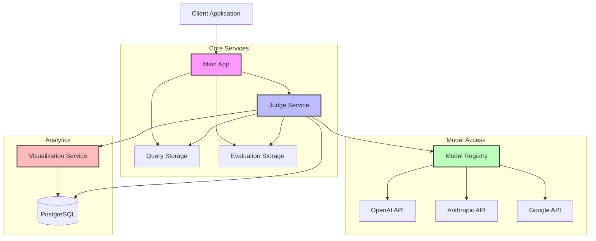

# Panopticon

[](http://localhost:8000/docs)
[](https://opensource.org/licenses/MIT)

## Overview

Panopticon is a comprehensive framework for evaluating and benchmarking Large Language Models (LLMs) across diverse tasks and criteria. Built with a microservices architecture, it enables systematic testing and comparison of multiple LLMs using customizable evaluation metrics.

**Key Features:**

- **Multi-provider Support**: Evaluate models from OpenAI, Anthropic, Google, and more with a unified interface
- **Metric-based Evaluation**: Create custom evaluation prompts and metrics to assess model outputs
- **Thematic Testing**: Group prompts by themes for focused evaluation of specific capabilities
- **Visualization Dashboard**: Compare model performance with interactive visualizations
- **Extensible Architecture**: Add new models, providers, and evaluation criteria easily

## System Architecture

Panopticon is composed of several specialized microservices:

### Architecture Diagram



### Service Descriptions

1. **Main App** (Port 8000)
   - Entry point for the system
   - Routes requests to appropriate services
   - Provides API documentation

2. **Query Storage Service** (Port 8001)
   - Stores test queries/prompts organized by themes
   - Enables search and retrieval of queries
   - Manages metadata for test cases

3. **Evaluation Storage Service** (Port 8002)
   - Manages evaluation metrics and criteria
   - Stores evaluation prompts used to judge model outputs
   - Categorizes metrics by type (clarity, accuracy, etc.)

4. **Judge Service** (Port 8003)
   - Core evaluation engine
   - Sends queries to LLMs via the Model Registry
   - Evaluates responses using evaluation prompts
   - Stores evaluation results in the database

5. **Visualization Service** (Port 8004)
   - Provides interactive dashboards and visualizations
   - Enables comparison of models across different metrics
   - Offers detailed analysis of model performance by theme

6. **Model Registry** (Port 8005)
   - Centralizes access to different LLM providers
   - Manages model configurations and credentials
   - Provides a unified interface for model completion requests

7. **PostgreSQL Database**
   - Stores evaluation results, model configurations, and analytics data
   - Enables complex queries for visualization and reporting

## User Workflows

### Adding Prompts (Test Queries)

To add new test queries to evaluate models:

1. **Create Individual Queries**

```bash
curl -X POST http://localhost:8001/api/v1/queries \
  -H "Content-Type: application/json" \
  -H "X-API-Key: dev_api_key_for_testing" \
  -d '{
    "query": "Explain the concept of quantum entanglement to a high school student.",
    "theme": "science_explanation",
    "metadata": {
      "difficulty": "medium",
      "domain": "physics"
    }
  }'
```

2. **Organize by Themes**

Group related queries under common themes (e.g., `science_explanation`, `creative_writing`, `ethical_reasoning`) to evaluate models on specific capabilities.

```bash
# Add another query to the same theme
curl -X POST http://localhost:8001/api/v1/queries \
  -H "Content-Type: application/json" \
  -H "X-API-Key: dev_api_key_for_testing" \
  -d '{
    "query": "Describe how nuclear fusion works and its potential as an energy source.",
    "theme": "science_explanation",
    "metadata": {
      "difficulty": "hard",
      "domain": "physics"
    }
  }'
```

3. **Retrieve Queries by Theme**

```bash
curl -X GET "http://localhost:8001/api/v1/queries/theme/science_explanation?limit=10" \
  -H "X-API-Key: dev_api_key_for_testing"
```

### Creating Evaluation Metrics

Evaluation metrics define how model outputs are judged:

1. **Define New Evaluation Metrics**

```bash
curl -X POST http://localhost:8002/api/v1/evaluation-metrics \
  -H "Content-Type: application/json" \
  -H "X-API-Key: dev_api_key_for_testing" \
  -d '{
    "prompt": "Evaluate the scientific accuracy of this explanation on a scale of 1-10. Consider: Are all stated facts correct? Are any important concepts missing or misrepresented? Provide your rating with a brief justification.",
    "metric_type": "scientific_accuracy",
    "metadata": {
      "description": "Measures factual correctness of scientific explanations",
      "scale": "1-10"
    }
  }'
```

2. **Create Multiple Metrics for Comprehensive Evaluation**

```bash
# Add a clarity metric
curl -X POST http://localhost:8002/api/v1/evaluation-metrics \
  -H "Content-Type: application/json" \
  -H "X-API-Key: dev_api_key_for_testing" \
  -d '{
    "prompt": "Rate the clarity of this explanation on a scale of 1-10. Consider: Is it easy to understand? Does it use appropriate language for the target audience? Are complex concepts broken down effectively? Provide your rating with a brief justification.",
    "metric_type": "clarity",
    "metadata": {
      "description": "Measures how clearly the information is communicated",
      "scale": "1-10"
    }
  }'
```

3. **Retrieve Metrics by Type**

```bash
curl -X GET "http://localhost:8002/api/v1/evaluation-metrics/type/clarity" \
  -H "X-API-Key: dev_api_key_for_testing"
```

### Evaluating Models

1. **Evaluate a Single Query with a Specific Model**

```bash
curl -X POST http://localhost:8003/api/v1/evaluate/query \
  -H "Content-Type: application/json" \
  -H "X-API-Key: dev_api_key_for_testing" \
  -d '{
    "query": "Explain quantum entanglement to a high school student.",
    "model_id": "gpt-4o-mini-2024-07-18",
    "theme": "science_explanation",
    "evaluation_prompt_ids": ["scientific_accuracy", "clarity"],
    "judge_model": "claude-3-7-sonnet-20250219",
    "model_provider": "openai"
  }'
```

2. **Evaluate a Model on All Queries in a Theme**

```bash
curl -X POST http://localhost:8003/api/v1/evaluate/theme \
  -H "Content-Type: application/json" \
  -H "X-API-Key: dev_api_key_for_testing" \
  -d '{
    "theme": "science_explanation",
    "model_id": "gemini-2.0-flash",
    "evaluation_prompt_ids": ["scientific_accuracy", "clarity"],
    "judge_model": "gpt-4o-mini-2024-07-18",
    "model_provider": "google"
  }'
```

3. **Adding a New Model for Evaluation**

If you want to evaluate a new model, it will be automatically registered the first time you use it:

```bash
curl -X POST http://localhost:8003/api/v1/evaluate/query \
  -H "Content-Type: application/json" \
  -H "X-API-Key: dev_api_key_for_testing" \
  -d '{
    "query": "What ethical considerations should guide the development of artificial general intelligence",
    "model_id": "gemini-2.0-flash-lite",
    "theme": "ethical_reasoning",
    "evaluation_prompt_ids": ["scientific_accuracy", "clarity"],
    "judge_model": "gpt-4o-mini-2024-07-18",
    "model_provider": "google"
  }'
```

Alternatively, you can manually register a model through the Model Registry:

```bash
curl -X POST http://localhost:8005/api/v1/models \
  -H "Content-Type: application/json" \
  -H "X-API-Key: dev_api_key_for_testing" \
  -d '{
    "id": "claude-3-opus-20240229",
    "provider_id": "anthropic",
    "config": {
      "max_tokens": 4096,
      "temperature": 0.7
    }
  }'
```

### Comparing Model Performance

1. **Retrieve Evaluation Results**

```bash
curl -X GET "http://localhost:8003/api/v1/results?theme=science_explanation&model_id=gemini-2.0-flash" \
  -H "X-API-Key: dev_api_key_for_testing"
```

2. **Visualize Results on Dashboard**

Access the visualization dashboard at http://localhost:8004 to:
- Compare models across different themes and metrics
- Analyze performance trends
- Drill down into detailed results for specific queries
- Generate comparative reports

## Cross-Provider Evaluation Workflow

Here's a complete workflow to evaluate and compare models from different providers:

### Step 1: Setup Test Queries

Create test queries across different themes:

```bash
# Add reasoning task
curl -X POST http://localhost:8001/api/v1/queries \
  -H "Content-Type: application/json" \
  -H "X-API-Key: your_api_key" \
  -d '{
    "query": "A bat and ball cost $1.10 in total. The bat costs $1.00 more than the ball. How much does the ball cost?",
    "theme": "reasoning",
    "metadata": {"type": "mathematical"}
  }'

# Add explanation task
curl -X POST http://localhost:8001/api/v1/queries \
  -H "Content-Type: application/json" \
  -H "X-API-Key: your_api_key" \
  -d '{
    "query": "Explain how the greenhouse effect works and its role in climate change.",
    "theme": "explanations",
    "metadata": {"domain": "climate science"}
  }'

# Add creative task
curl -X POST http://localhost:8001/api/v1/queries \
  -H "Content-Type: application/json" \
  -H "X-API-Key: your_api_key" \
  -d '{
    "query": "Write a short story about a robot discovering emotions.",
    "theme": "creative",
    "metadata": {"type": "narrative"}
  }'
```

### Step 2: Create Evaluation Metrics

```bash
# Correctness metric
curl -X POST http://localhost:8002/api/v1/evaluation-metrics \
  -H "Content-Type: application/json" \
  -H "X-API-Key: your_api_key" \
  -d '{
    "prompt": "Evaluate the correctness of this answer. Is the reasoning sound and is the final answer correct? Rate on a scale of 1-10.",
    "metric_type": "correctness",
    "metadata": {"domain": "reasoning"}
  }'

# Clarity metric
curl -X POST http://localhost:8002/api/v1/evaluation-metrics \
  -H "Content-Type: application/json" \
  -H "X-API-Key: your_api_key" \
  -d '{
    "prompt": "Evaluate how clearly the response explains its reasoning. Is the explanation easy to follow? Rate on a scale of 1-10.",
    "metric_type": "clarity",
    "metadata": {"domain": "explanation"}
  }'

# Creativity metric
curl -X POST http://localhost:8002/api/v1/evaluation-metrics \
  -H "Content-Type: application/json" \
  -H "X-API-Key: your_api_key" \
  -d '{
    "prompt": "Evaluate the creativity and originality of this response. Does it present novel ideas and perspectives? Rate on a scale of 1-10.",
    "metric_type": "creativity",
    "metadata": {"domain": "creative writing"}
  }'
```

### Step 3: Evaluate Models from Different Providers

```bash
# Evaluate OpenAI's GPT-4
curl -X POST http://localhost:8003/api/v1/evaluate/theme \
  -H "Content-Type: application/json" \
  -H "X-API-Key: your_api_key" \
  -d '{
    "theme": "reasoning",
    "model_id": "gpt-4-turbo",
    "model_provider": "openai",
    "evaluation_prompt_ids": ["correctness", "clarity"],
    "judge_model": "claude-3-opus-20240229"
  }'

# Evaluate Anthropic's Claude
curl -X POST http://localhost:8003/api/v1/evaluate/theme \
  -H "Content-Type: application/json" \
  -H "X-API-Key: your_api_key" \
  -d '{
    "theme": "reasoning",
    "model_id": "claude-3-opus-20240229",
    "model_provider": "anthropic",
    "evaluation_prompt_ids": ["correctness", "clarity"],
    "judge_model": "gpt-4-turbo"
  }'

# Evaluate Google's Gemini
curl -X POST http://localhost:8003/api/v1/evaluate/theme \
  -H "Content-Type: application/json" \
  -H "X-API-Key: your_api_key" \
  -d '{
    "theme": "reasoning",
    "model_id": "gemini-pro",
    "model_provider": "google",
    "evaluation_prompt_ids": ["correctness", "clarity"],
    "judge_model": "gpt-4-turbo"
  }'
```

### Step 4: Compare Results

Access the visualization dashboard at http://localhost:8004 to compare model performance:

1. Navigate to the "Model Comparison" view
2. Select models from different providers
3. Compare scores across metrics and themes
4. Analyze strengths and weaknesses of each model

## Setup and Configuration

### Environment Variables

Configure the system using these environment variables:

```
# API Authentication
API_KEY=your_api_key_here

# LLM API Keys
LITELLM_API_KEY=your_openai_api_key_here
GOOGLE_API_KEY=your_gemini_api_key_here
ANTHROPIC_API_KEY=your_anthropic_api_key_here

# Database Configuration
POSTGRES_HOST=postgres
POSTGRES_PORT=5432
POSTGRES_USER=postgres
POSTGRES_PASSWORD=postgres
POSTGRES_DB=panopticon
```

### Running with Docker Compose

Start all services with:

```bash
docker-compose up -d
```

This launches:
- Main App: http://localhost:8000
- Query Storage: http://localhost:8001
- Evaluation Storage: http://localhost:8002
- Judge Service: http://localhost:8003
- Visualization Service: http://localhost:8004
- Model Registry: http://localhost:8005

### API Documentation

Access Swagger documentation for each service at their respective URLs with the `/docs` path:
- http://localhost:8000/docs
- http://localhost:8001/docs
- http://localhost:8002/docs
- http://localhost:8003/docs
- http://localhost:8004/docs
- http://localhost:8005/docs
